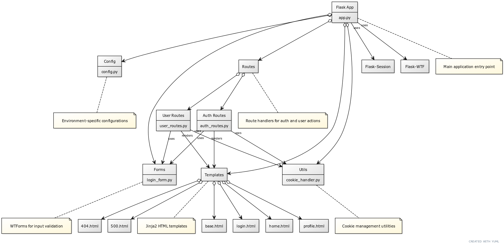

# Flask Session Management App

This is a Flask application demonstrating session management and user authentication.

## Features

- User login with username validation
- Session management using Flask-Session
- Profile page with visit counter
- Logout functionality
- Error handling (404 and 500 pages)
- Configurable settings for different environments (development, production, testing)


## Architecture

Here's a high-level overview of the application architecture:



## Folder Structure

``` bash
session-management-flask-app/
│
├── src/
│ ├── forms/                      # Directory for form-related files
│ │ └── login_form.py             # Defines the LoginForm class for user authentication
│ ├── routes/                     # Directory for route handlers
│ │ ├── auth_routes.py            # Handles authentication-related routes (login, logout)
│ │ └── user_routes.py            # Handles user-related routes (home, profile)
│ ├── static/                     # Directory for static files
│ │ └── style.css                 # Contains CSS styles for the application
│ ├── templates/                  # Directory for HTML templates
│ │ ├── 404.html                  # Template for 404 Not Found error page
│ │ ├── 500.html                  # Template for 500 Internal Server Error page
│ │ ├── base.html                 # Base template that other templates extend
│ │ ├── home.html                 # Template for the home page
│ │ ├── login.html                # Template for the login page
│ │ └── profile.html              # Template for the user profile page
│ ├── tests/                      # Directory for test files
│ │ ├── init.py                   # Makes tests a Python package
│ │ └── test_app.py               # Contains unit tests for the application
│ ├── utils/                      # Directory for utility functions
│ │ └── cookie_handler.py         # Provides functions for cookie management
│ ├── app.py                      # Main application file, sets up Flask app and configurations
│ └── config.py                   # Contains configuration classes for different environments
├── images/                       # Directory for image files used in README
├── .gitattributes                # Git attributes file
├── .gitignore                    # Git ignore file
├── LICENSE                       # MIT License file
├── README.md                     # This file
└── requirements.txt              # Lists project dependencies
```

## Installation

1. Clone the repository:

   ```bash
   git clone https://github.com/spicy/session-management-flask-app.git
   cd session-management-flask-app
   ```

2. Create a virtual environment:

   ```bash
   python -m venv venv
   ```

3. Activate the virtual environment:
   - On Windows:

     ```bash
     venv\Scripts\activate
     ```

   - On macOS and Linux:

     ```bash
     source venv/bin/activate
     ```

4. Install dependencies:

   ```bash
   pip install -r requirements.txt
   ```

## Configuration

The application uses different configuration classes for development, production, and testing environments. You can modify these in `src/config.py`.

To set the environment, use the `FLASK_ENV` environment variable:

- For development: `set FLASK_ENV=development` (Windows) or `export FLASK_ENV=development` (Unix)
- For production: `set FLASK_ENV=production` (Windows) or `export FLASK_ENV=production` (Unix)

Ensure that the `SECRET_KEY` is set in the environment variables.

- Example: `set SECRET_KEY=your_secret_key` (Windows) or `export SECRET_KEY=your_secret_key` (Unix)

## Running the Application

1. Set the Flask application: `set FLASK_APP=src/app.py` (Windows) or `export FLASK_APP=src/app.py` (Unix)

2. Run the application:

   ```bash
   flask run
   ```

3. Open a web browser and navigate to `http://127.0.0.1:5000`

## Usage

1. Navigate to the login page at `http://127.0.0.1:5000/login`
2. Enter a username in the format Firstname_Lastname (e.g., John_Doe)
3. After successful login, you'll be redirected to the home page
4. Click on "Profile" to view your profile and visit count
5. Use the "Logout" link to end your session

## Testing

To run the tests:

1. Ensure you're in the project root directory
2. Run the following command:

   ```bash
   pytest src/tests
   ```

This will execute all the tests in the `src/tests/` directory.

## Security Features

- CSRF protection using Flask-WTF
- Secure session management with Flask-Session
- HTTP-only cookies
- Configurable secure cookies for HTTPS
- Input validation for username

## Logging

The application logs errors and important events to `logs/flask_app.log` using a RotatingFileHandler. To view logs:

1. Check the `logs/` directory in the project root
2. Open `flask_app.log` to view logged information

## Images

### Login Page


### Profile Page


### Profile Page with Visit Count


### Profile Page after Logout


### 404 Error Page


### Home Page


## Contributing

1. Fork the repository
2. Create a new branch: `git checkout -b feature-branch-name`
3. Make your changes and commit them: `git commit -m 'Add some feature'`
4. Push to the branch: `git push origin feature-branch-name`
5. Create a pull request

## License

This project is licensed under the MIT License. See the [LICENSE](LICENSE) file for details.
